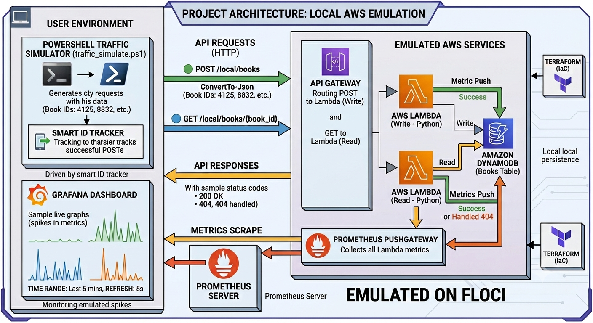
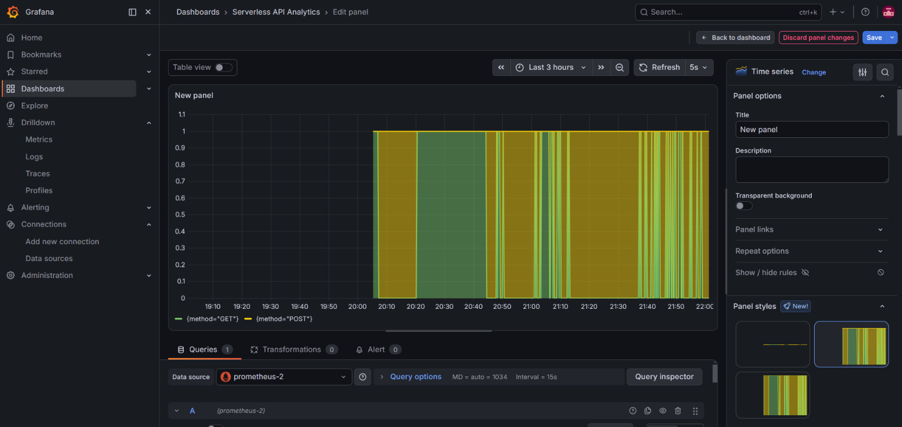
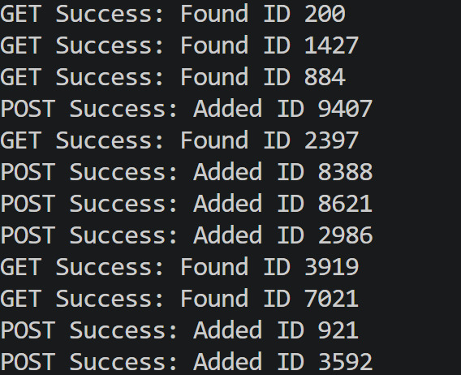
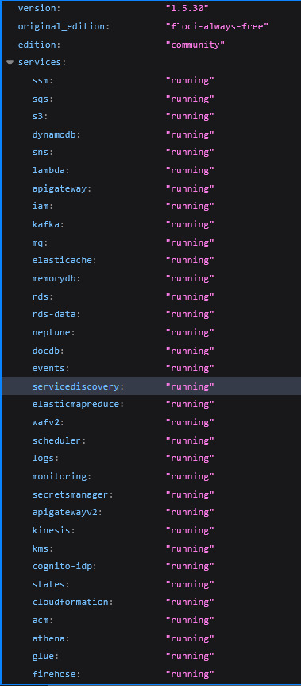
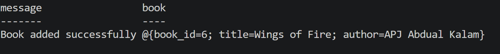
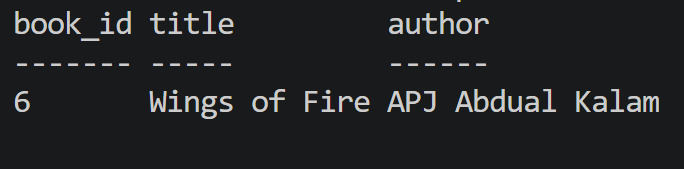

# 📚 Cloud Network & Monitoring (AWS Serverless Book API)

<p align="center">
  
</p>

<p align="center">


</p>

An end-to-end **Cloud Network & Monitoring project** that provisions a complete **Book Directory API** using Infrastructure as Code and demonstrates a production-style **observability pipeline** with real-time traffic generation and monitoring.

The entire environment runs locally using **Floci**, making it ideal for learning AWS serverless architecture without requiring an AWS account.

---

# ✨ Features

- 🚀 Fully automated infrastructure provisioning using Terraform
- ☁️ Local AWS cloud emulation using Floci
- ⚡ Serverless API using API Gateway and Lambda
- 🗄️ DynamoDB-backed Book Directory storage
- 📊 Real-time monitoring with Prometheus and Grafana
- 🔄 Continuous traffic generation using PowerShell automation
- 📈 Live request and latency visualization
- 🐳 Containerized monitoring stack using Docker Compose

---

# 🏗️ Architecture Overview

```text
Traffic Simulator
        │
        ▼
API Gateway
        │
        ▼
AWS Lambda Function
        │
        ▼
DynamoDB
        │
        ├── Metrics
        ▼
Prometheus Pushgateway
        │
        ▼
Prometheus Server
        │
        ▼
Grafana Dashboard
```

---

# Architecture Diagram

<p align="center">
  
</p>

---

# 📸 Screenshots

## Grafana Dashboard





## Traffic Simulator



## Floci




---

# 🛠️ Technology Stack

| Category | Technology |
|----------|------------|
| Cloud Emulation | Floci (AWS Environment)|
| Infrastructure as Code | Terraform |
| Runtime | Python  |
| API Layer | API Gateway |
| Compute | AWS Lambda |
| Database | DynamoDB |
| Monitoring | Prometheus |
| Visualization | Grafana |
| Traffic Generation | PowerShell |
| Containerization | Docker |

---

# 📂 Project Structure

```text
CNM/
├── assets/
│   ├── diagram.png
│   ├── floci.jpeg
│   ├── get-req.jpeg
│   ├── grafana-dashboard.jpeg
│   ├── livedemo.mp4
│   ├── post-req.jpeg
│   └── traffic-simulator.jpeg
├── docker/
│   ├── docker-compose.yml
│   └── prometheus.yml
├── src/
│   ├── lambdafunc.py
│   └── requirements.txt
├── terraform/
│   ├── main.tf
│   └── provider.tf
├── lambda.zip
├── readme.md
└── traffic_simulate.ps1
```

---

# ⚙️ Prerequisites

Install the following before running the project:

- Docker
- Docker Compose
- Terraform
- PowerShell 
- Python 
- AWS CLI 


---

# 🚀 Quick Start

## 1. Clone the Repository

```bash
git clone https://github.com/chandra-64/CNM.git
cd CNM
```

---

## 2. Start floci and Monitoring Stack

```bash
docker compose -f docker/docker-compose.yml up -d
```

Verify containers are running:

```bash
docker ps
```

---

## 3. Deploy Infrastructure

```bash
cd terraform

terraform init

terraform apply -auto-approve

cd ..
```

Terraform provisions:

- API Gateway
- Lambda Function
- DynamoDB Table

---

## 4. Copy the Generated API Endpoint

Example:

```text
API OUTPUT: fdf10b31dd
```

```text
http://localhost:4566/_aws/execute-api/fdf10b31dd/local/books
```

---

## 5. Configure the Traffic Simulator

Open:

```text
traffic_simulate.ps1
```

Update:

```powershell
$api = "http://localhost:4566/_aws/execute-api/YOUR_API_ID/local/books"
```

Replace `YOUR_API_ID` with the value generated by Terraform.

---

## 6. Start Generating Traffic

```powershell
.\traffic_simulate.ps1
```

The simulator continuously generates:

- POST requests
- GET requests
- Randomized traffic patterns
- Delayed requests for realistic load behavior

---

## 7. Open Grafana Dashboard

Open your browser and navigate to:

```text
http://localhost:3000
```

Default credentials:

```text
Username: admin
Password: admin
```

Open dashboard:


Recommended settings:

| Setting | Value |
|---------|-------|
| Time Range | Last 5 Minutes |
| Refresh Interval | 5 Seconds |

---

# 📊 Metrics Collected

## The observability pipeline collects:

### Raw Metrics Pushed by Lambda

- **api_requests_total:** Tracks every incoming request. 

    * **Method:** POST (writes)  GET (reads).

    * **Status Code:** 200 (Success), 404 (Not Found/Handled), and 500 (Server Error).

### Calculated Grafana Visualizations

- **Total Request Volume:** The overall count of API calls hitting the system.

- **Request Rate:** Live calculated requests per second to showcase real-time traffic spikes during simulation.

- **Average API Latency:** Real-time monitoring of response delay, showing how fast DynamoDB read/write transactions are performing.

---

# 🔍 Example API Requests (Manual)

## Set API ENV
```bash
$env:api = "http://localhost:4566/_aws/execute-api/your-api-id/local/books"
```

## Create a Book

### Post-Request

```bash
Invoke-RestMethod -Uri $api -Method Post -ContentType "application/json" -Body @{book_id="6"; title="Wings of Fire"; author="APJ Abdul Kalam"}
```



---

## Get a Book

### Get-Request

```bash
Invoke-RestMethod -Uri "$api/6" -Method Get
```

### Response



---

# 🔧 Troubleshooting

## PowerShell Parser Error


#### **RECOMMENDED**

- Close the current PowerShell terminal.
- Open a new PowerShell terminal.
- Run the script again:

```powershell
.\traffic_simulate.ps1
```

---

## API Gateway Timeout or Network Errors

If you redeploy Terraform, the API ID may change.

Run:

```bash
terraform output
```

Update the value in:

```powershell
$api = "NEW_API_URL"
```

---

## Grafana Dashboard Shows No Data

Verify that:

- LocalStack is running
- Prometheus is running
- Pushgateway is running
- Traffic simulator is generating requests

Check containers:

```bash
docker ps
```

---

# 🚀 Future Improvements

- CI/CD using GitHub Actions
- Deployment to real AWS
- Load testing with k6
- CloudWatch metrics support

---

# 👨‍💻 Author

**Chandra Shekar**

 • Cloud Enthusiast

GitHub: https://github.com/chandra-64

---

# 📄 License

This project is licensed under the **MIT License**.

---

<p align="center">
⭐ If you found this project useful, consider giving it a star!
</p>